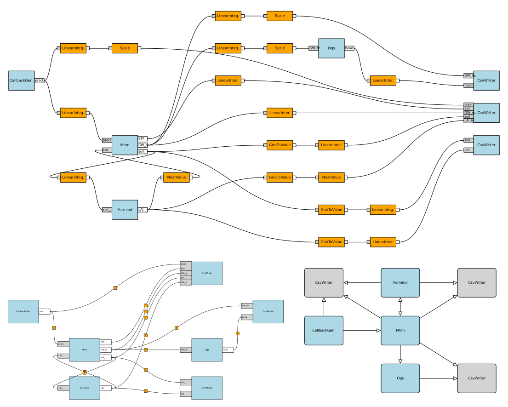

:html_theme.sidebar_secondary.remove: true

===========
FINAM Graph
===========

A tool for visualizing `FINAM <https://finam.pages.ufz.de/>`_ model coupling setups.

Quickstart
----------

Installation:

.. code-block:: Shell

    $ pip install git+https://git.ufz.de/FINAM/finam-graph.git

Usage
-----

The main class of this package is :class:`.GraphDiagram`.
For other package members, see the :doc:`api/index`.

API References
--------------

Information about the API of FINAM-graph.

.. toctree::
    :hidden:
    :maxdepth: 1

    self

.. toctree::
    :maxdepth: 1

    api/index

About
-----

Further information about licensing, the developers team and the changelog of FINAM-graph.

.. toctree::
  :maxdepth: 2

  about/index

License
^^^^^^^

LGPLv3, Copyright © 2021-2023, the FINAM developers from Helmholtz-Zentrum für Umweltforschung GmbH - UFZ. All rights reserved.
